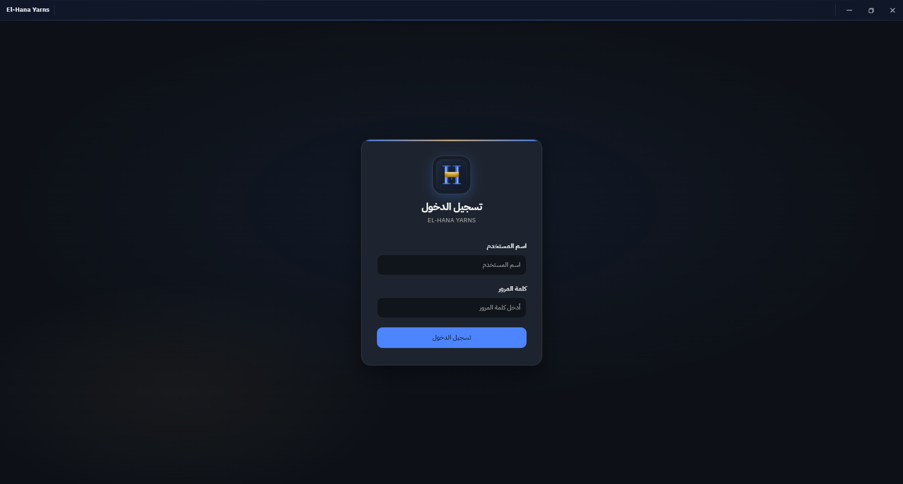
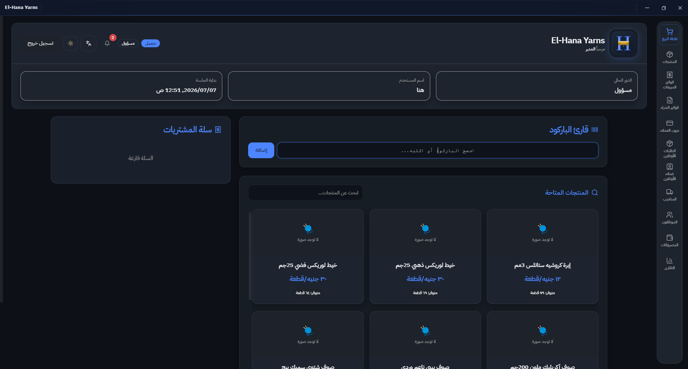
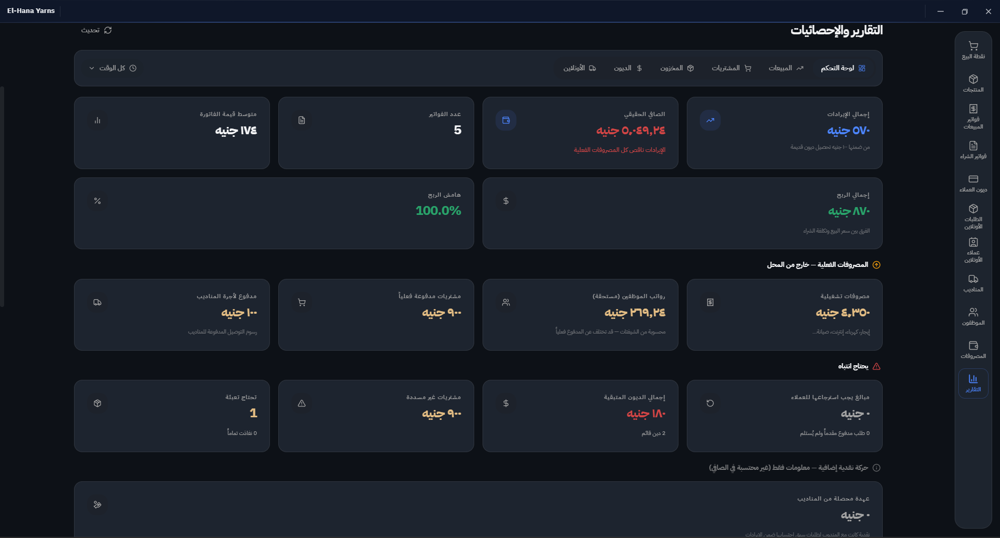
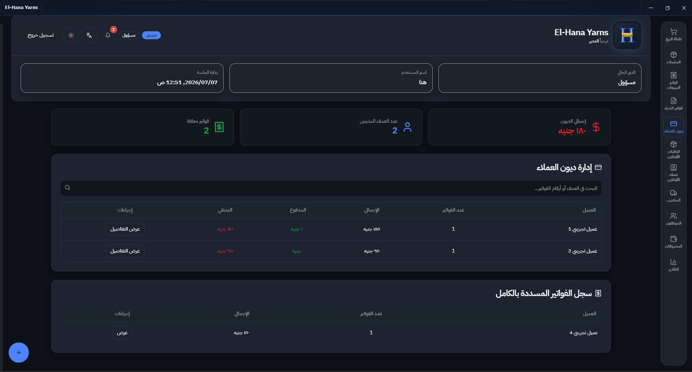
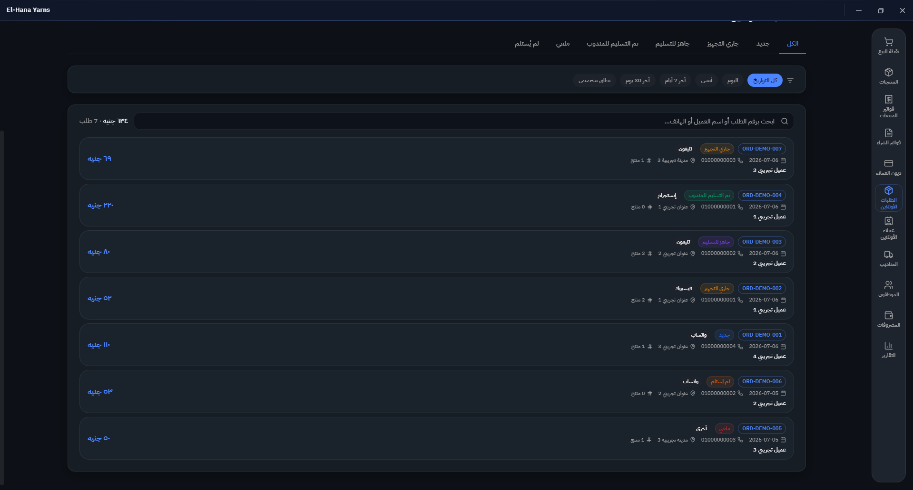
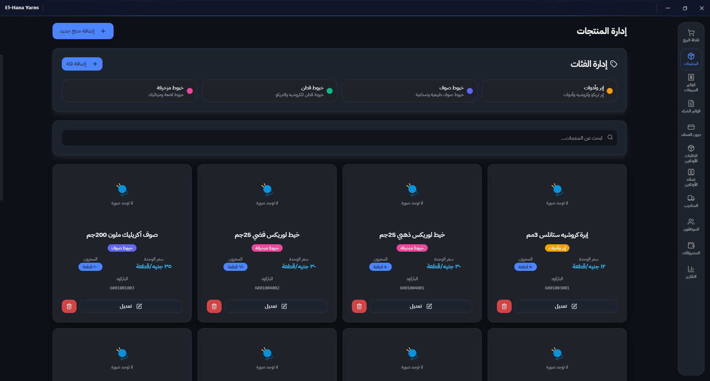

<div align="center">

# 🧶 El-Hana Yarns POS

### الهناء للخيوط — Offline-First Point of Sale & Inventory Management

[](#)
[](#)
[](#)
[](#)
[](#)
[](#)
[](LICENSE)
[](https://github.com/Ziad-Thabet/El-Hana-Yarns/actions/workflows/ci.yml)

</div>

> **A desktop-native, offline-first POS and inventory system purpose-built for a yarn
> retail business** — barcode-driven sales, Arabic/English bilingual UI, customer debt
> ledgers, and full financial reporting, running entirely on the shop's own machine.

---

## 📸 Preview

| Login                                | Sales Terminal                                         | Reports Dashboard                                            |
| ------------------------------------ | ------------------------------------------------------ | ------------------------------------------------------------ |
|  |  |  |

| Debt Ledger                                      | Online Orders                                        | Product Management                                   |
| ------------------------------------------------ | ---------------------------------------------------- | ---------------------------------------------------- |
|  |  |  |

---

## Table of Contents

- [Core Features](#-core-features)
- [Tech Stack](#-tech-stack)
- [Prerequisites](#-prerequisites)
- [Local Development](#-local-development)
- [Production Build](#-production-build)
- [Architecture](#-architecture)
- [Security Posture](#-security-posture)
- [License](#-license)

---

## ✨ Core Features

- 🔖 **Barcode-driven sales terminal** — fast checkout flow with cart, quantity, and payment-split editing
- 👥 **Multi-role authentication** — admin / staff roles with per-session access control
- 🌐 **Localized Arabic RTL interface engine** — single source-of-truth translation dictionaries, full RTL layout support
- 📴 **Offline-first reliability** — local SQLite database, no internet dependency for day-to-day operation
- 💳 **Credit & debt ledger reporting** — customer debt tracking, partial payments, collection history
- 📊 **Expense & financial dashboards** — shift summaries, gross profit/margin reporting, growth badges
- 🚚 **Online order & delivery management** — four-stage order lifecycle with driver dispatch and held-stock reservation
- 🧾 **Invoice printing & payment tracking** — cash / Vodafone Cash / Instapay with receipt image upload

---

## 🛠 Tech Stack

| Layer          | Technology                         |
| -------------- | ---------------------------------- |
| Desktop shell  | Electron                           |
| UI             | React 18+, TypeScript              |
| Build tooling  | Vite                               |
| Styling        | Tailwind CSS                       |
| Database       | better-sqlite3 (native C++ module) |
| State/data     | React Query, React Context         |
| Virtualization | `@tanstack/react-virtual`          |

---

## ✅ Prerequisites

- **OS:** Windows 10/11 (x64) — primary deployment target
- **Node.js:** 22.x (matches CI — see .github/workflows/ci.yml)
- **npm:** bundled with Node.js
- **Visual Studio Build Tools** (Desktop development with C++ workload) — required to compile the native `better-sqlite3` module
- **Python 3.x** — required by `node-gyp` during native module builds

---

## 🚀 Local Development

```bash
git clone https://github.com/Ziad-Thabet/El-Hana-Yarns.git
cd El-Hana-Yarns

npm install

# Rebuild native modules against Electron's Node ABI
npx electron-rebuild

npm run dev
```

On first launch, if no local database exists yet, the app seeds itself automatically
from a sanitized demo dataset (see `GIT_WORKFLOW.md` for how that's generated).

**Default development credentials:**

| Role  | Username | Password   |
| ----- | -------- | ---------- |
| Admin | `admin`  | `admin123` |
| Staff | `staff`  | `staff123` |

> ⚠️ These are **development-only** fallback credentials. Never use them in production —
> see [Security Posture](#-security-posture).

### Troubleshooting native module builds

| Symptom                                                         | Fix                                                                                         |
| --------------------------------------------------------------- | ------------------------------------------------------------------------------------------- |
| `better-sqlite3` fails to load / `NODE_MODULE_VERSION` mismatch | Run `npx electron-rebuild` again after any `npm install`                                    |
| `node-gyp` errors on Windows                                    | Confirm Visual Studio Build Tools has the "Desktop development with C++" workload installed |
| App builds but crashes on DB access                             | Delete the local `userData` DB and relaunch to trigger re-seed                              |

---

## 📦 Production Build

```bash
npm run build
npm run electron:build
```

Native modules (`better-sqlite3` and its `.node` binary) are excluded from the ASAR
archive via `asarUnpack` in the Electron builder config — native bindings cannot be
loaded from inside a packed ASAR archive at runtime, so they're unpacked alongside it.

---

## 🗂 Architecture

```
├── db/
│   ├── repositories/       # One repository per domain (sales, products, debts, ...)
│   └── helpers/            # Shared query/date/id utilities
├── shared/                 # Cross-process enums & constants (main + renderer)
├── src/
│   ├── features/           # Feature-sliced modules: sales, purchases, reports,
│   │                       # expenses, customers-debts, online-orders, drivers, employees
│   ├── lib/
│   │   ├── i18n/           # ar.ts / en.ts — single source of truth for all UI strings
│   │   ├── config/         # App-level config & navigation
│   │   ├── constants/      # Shared constants (payment types, statuses, shifts)
│   │   └── theme/          # Design tokens & styling
│   └── components/         # Shared layout & UI primitives
├── electron-main.cjs       # Main process entry — IPC bridge, DB bootstrap
├── preload.js              # Context-isolated IPC bridge to the renderer
├── database.cjs            # Public DB entry point (wraps repository layer)
└── seed-demo.cjs           # Generates the sanitized demo dataset
```

---

## 🔒 Security Posture

- **Change all default credentials** before any production deployment — the
  `admin` / `admin123` pair is for local development only.
- **Rotate application salts/secrets** used for password hashing before going live.
- **Back up the `userData` directory regularly** — it holds the real production
  database and is intentionally excluded from version control.
- **Never commit real client data** — `.db`, `.sqlite`, and `userdata/` paths are
  git-ignored by design; see `GIT_WORKFLOW.md` for verification steps and the
  remediation protocol if something slips through.
- Consult `UPGRADE_GUIDE.md` for ongoing maintenance and migration notes.

---

## 📄 License

Proprietary — built for a specific retail client. Not licensed for redistribution
unless otherwise agreed.

---

## 📚 Additional Documentation

- [CHANGELOG](CHANGELOG.md) — development history and version notes
- [CONTRIBUTING](CONTRIBUTING.md) — coding standards, branching, PR checklist
- [SECURITY](SECURITY.md) — vulnerability reporting
- [CODE OF CONDUCT](CODE_OF_CONDUCT.md)
