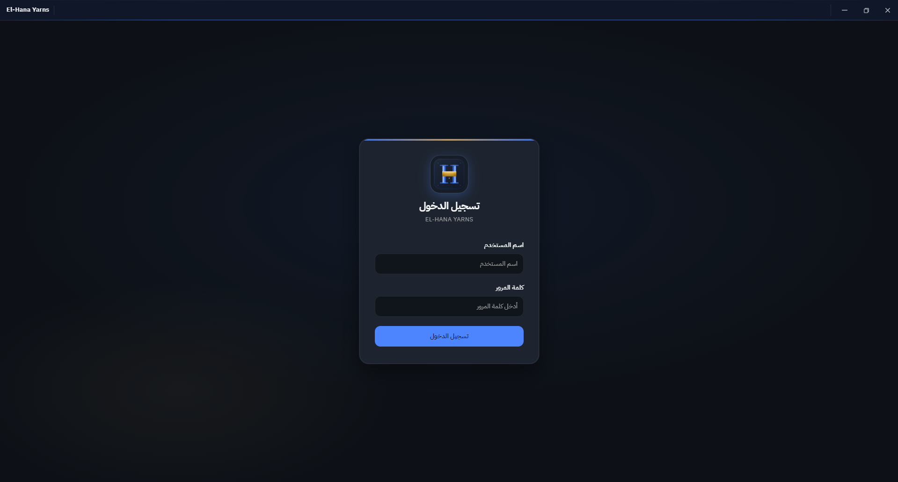
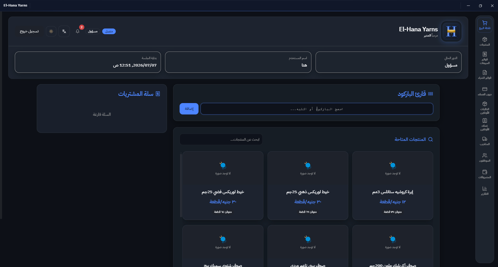
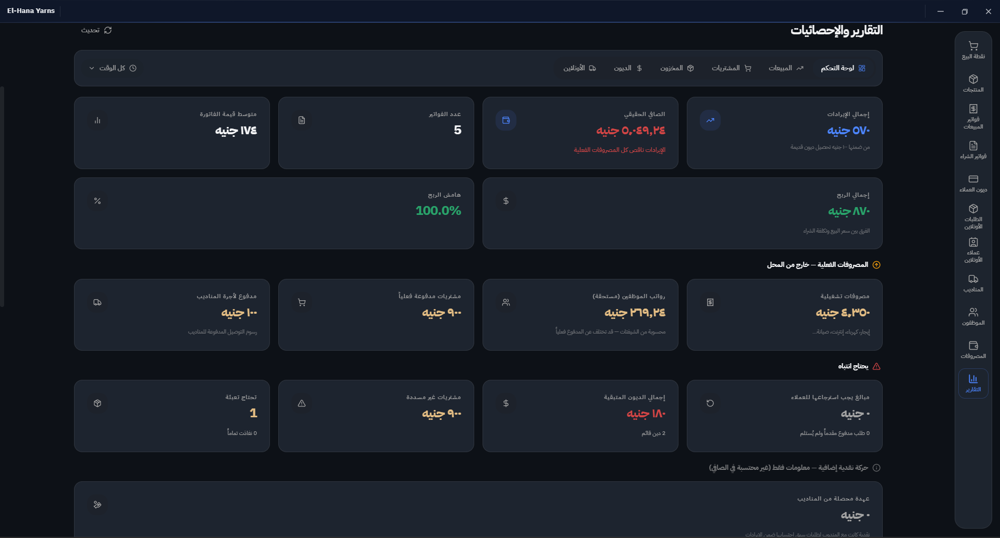
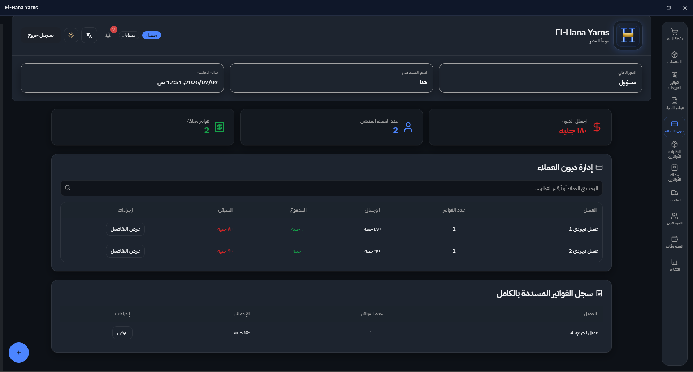
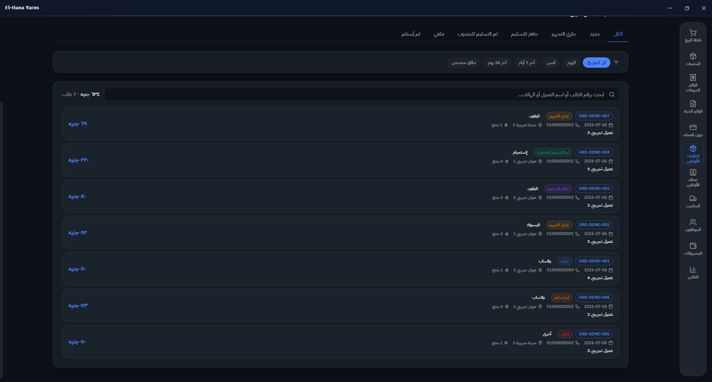
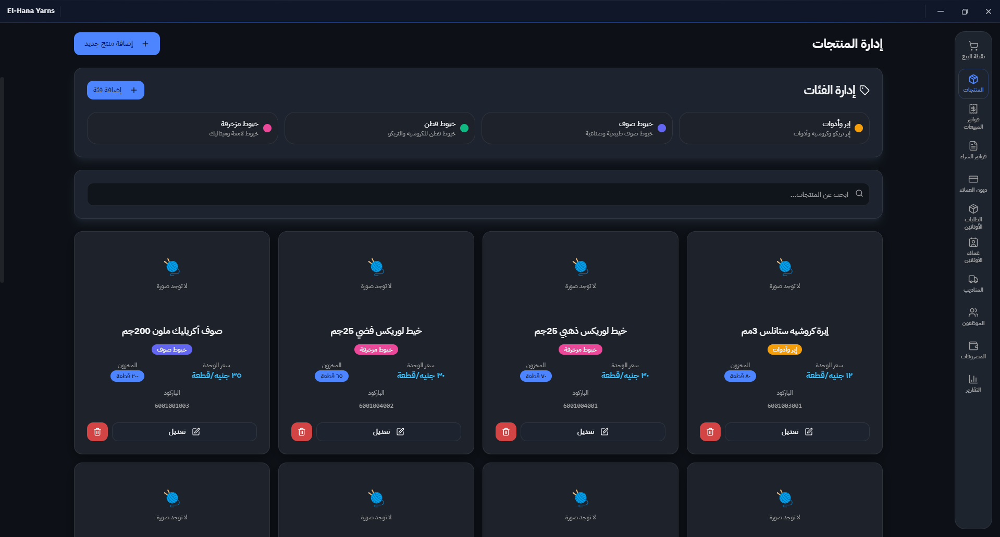

<div align="center">

# 🧶 El-Hana Yarns POS

### Offline-First Point of Sale & Inventory Management

[](#)
[](#)
[](#)
[](#)
[](#)
[](#)
[](LICENSE)
[](https://github.com/Ziad-Thabet/El-Hana-Yarns/actions/workflows/ci.yml)

</div>

> **A desktop-native, offline-first POS and inventory system built for a yarn
> retail business** — barcode-driven sales, an Arabic-first bilingual interface,
> customer debt ledgers, returns, shift accounting and financial reporting,
> running entirely on the shop's own machine with no server and no internet
> dependency.

---

## 📸 Preview

| Login                                | Sales Terminal                                         | Reports Dashboard                                            |
| ------------------------------------ | ------------------------------------------------------ | ------------------------------------------------------------ |
|  |  |  |

| Debt Ledger                                      | Online Orders                                        | Product Management                                   |
| ------------------------------------------------ | ---------------------------------------------------- | ---------------------------------------------------- |
|  |  |  |

---

## Table of Contents

- [Core Features](#-core-features)
- [Tech Stack](#-tech-stack)
- [Prerequisites](#-prerequisites)
- [Local Development](#-local-development)
- [Tests](#-tests)
- [Production Build](#-production-build)
- [Architecture](#-architecture)
- [Security Posture](#-security-posture)
- [License](#-license)

---

## ✨ Core Features

**Selling**

- **Barcode-driven terminal** — cart, weighted and per-piece items, split
  payments across methods, change calculation, and partial payment onto a
  customer's debt.
- **Returns and voids** — line-level returns with restock or write-off,
  refunded against the original payment methods pro rata, or written off an
  outstanding debt when the invoice was never paid.
- **Shift accounting** — takings per payment method, and a close that starts
  with a **blind cash count**: the drawer is counted first, the expected total
  is revealed afterwards, and the over/short difference is recorded with an
  explanation when it is large enough to matter.

**Money**

- **Customer debt ledger** — per-customer balances, partial collections,
  payment history, and ageing.
- **Purchases and suppliers** — supplier invoices, payments, and stock that
  reverses correctly when an invoice is deleted.
- **Expenses and payroll** — categorised expenses and salary history.
- **Reports** — sales, inventory, debts, purchases, expenses and online orders
  over any date range.
- **End-of-day workbook** — an eleven-sheet Excel export of a chosen day or
  range, built off the main process so a busy day never blocks the UI.

**Operations**

- **Online orders and delivery** — order lifecycle with driver dispatch, held
  stock reservation and driver settlements.
- **Configurable operating rules** — stock thresholds, shift length, session
  timeout, lockout policy, backup retention, receipt width, shop identity and
  more are stored as settings rather than compiled in.
- **Data-driven payment methods** — methods are rows, not an enum, and shift
  totals are derived from what was actually collected.
- **Activity log** — an append-only record of every sensitive action: who,
  what, when, and whether it succeeded, failed, or was denied. Passwords are
  redacted before the record is written, and the table rejects updates and
  deletes at the database level.
- **Automatic backups** — periodic `VACUUM INTO` snapshots with retention, an
  integrity check before every restore, and a safety copy taken at restore time.

**Platform**

- **Bilingual Arabic/English** — one dictionary per language, with the layout
  mirroring between RTL and LTR.
- **Offline-first** — a local SQLite database in WAL mode. Nothing leaves the
  machine.
- **Capability-based permissions** — every IPC channel is gated by a named
  capability held by a role, seeded in the database rather than compiled in.

---

## 🛠 Tech Stack

| Layer          | Technology                                      |
| -------------- | ----------------------------------------------- |
| Desktop shell  | Electron (context isolation + sandbox enabled)  |
| UI             | React 18+, TypeScript                           |
| Build tooling  | Vite                                            |
| Styling        | Tailwind CSS, shadcn/ui                         |
| Database       | better-sqlite3 (native C++ module), WAL mode    |
| State/data     | React Query, React Context                      |
| Virtualization | `@tanstack/react-virtual`                       |
| Spreadsheets   | ExcelJS, in a utility process                   |

---

## ✅ Prerequisites

- **OS:** Windows 10/11 (x64) — the deployment target
- **Node.js:** 22.x (matches CI — see `.github/workflows/ci.yml`)
- **npm:** bundled with Node.js
- **Visual Studio Build Tools** with the "Desktop development with C++"
  workload — required to compile `better-sqlite3`
- **Python 3.x** — required by `node-gyp` during native module builds

---

## 🚀 Local Development

```bash
git clone https://github.com/Ziad-Thabet/El-Hana-Yarns.git
cd El-Hana-Yarns

npm install          # postinstall rebuilds better-sqlite3 against Electron's ABI

npm run dev          # terminal 1 — Vite dev server on :8080
npm run electron:dev # terminal 2 — the desktop shell, pointed at that server
```

### First run

There are **no default accounts**. On a database with no users, the app opens a
registration screen and the first account created becomes the owner (`admin`).
Anything shipped with a known password would still be there a year later, which
is why nothing is.

To fill a development database with demo data — catalogue, customers, sales,
purchases, debts, shifts, expenses, drivers and online orders:

```bash
node seed-demo.cjs           # add demo data
node seed-demo.cjs --clear   # remove it again
```

The seeder creates two accounts of its own (`admin` / `admin1234` and
`cashier` / `cashier1234`). They exist so the demo rows have owners — **never
seed a shop's real database.**

### Troubleshooting

| Symptom                                                        | Fix                                                                                                |
| -------------------------------------------------------------- | -------------------------------------------------------------------------------------------------- |
| `better-sqlite3` fails to load / `NODE_MODULE_VERSION` mismatch | Run `npm run rebuild` — the module must be built against Electron's ABI, not the system Node's      |
| `node-gyp` errors on Windows                                    | Confirm Visual Studio Build Tools has the "Desktop development with C++" workload                   |
| A script that opens the database throws `ERR_DLOPEN_FAILED`     | Run it under Electron: `set ELECTRON_RUN_AS_NODE=1` then `node_modules\.bin\electron script.cjs`    |
| The window is blank                                             | The Vite dev server is not up — `npm run dev` has to be running before `npm run electron:dev`       |

---

## 🧪 Tests

```bash
npm test                  # build a fixture database, run every suite
npm test -- settings      # only suites whose filename matches
npm test -- --keep        # leave the fixture on disk for inspection
```

452 checks across 19 suites, run on every pull request. They drive the real
repositories against a database the runner builds from scratch through the
application's own bring-up, so no real data is needed and none is committed.
See [`tests/README.md`](tests/README.md).

---

## 📦 Production Build

```bash
npm run electron:build    # builds the renderer, then packages with electron-builder
```

Native modules (`better-sqlite3`, `sharp`) are excluded from the ASAR archive
via `asarUnpack` — native bindings cannot be loaded from inside a packed
archive at runtime, so they are unpacked alongside it.

---

## 🗂 Architecture

Three processes, with a single gate between them:

- **Main** owns the database, the filesystem and every privileged operation.
- **Preload** exposes a frozen, explicitly enumerated API over
  `contextBridge` — the renderer never sees `ipcRenderer`.
- **Renderer** is sandboxed and holds no credentials; it asks for things by
  channel name and gets data back.

Every request passes through one `handle()` wrapper in `electron-main.cjs`,
which resolves the session, checks the channel's capability, and records the
outcome in the activity log. A channel cannot be added without a permission,
and an audited action cannot be forgotten, because there is nowhere else to add
one.

```
├── db/
│   ├── migrations.cjs      # versioned schema migrations (PRAGMA user_version)
│   ├── backup.cjs          # VACUUM INTO snapshots, retention, restore
│   ├── repositories/       # one repository per domain — all SQL lives here
│   └── helpers/            # transactions, dates, ids, images, numbers
├── shared/                 # rules shared by main and renderer (.cjs + .mjs)
│                           # settings schema, stock units, receipt identity
├── workers/                # utility-process jobs (Excel workbook building)
├── src/
│   ├── features/           # sales, purchases, reports, expenses, customers,
│   │                       # online-orders, drivers, employees, settings,
│   │                       # audit, alerts, auth
│   ├── lib/i18n/           # ar.data.ts / en.ts — every UI string
│   ├── lib/api.ts          # the renderer's typed view of the IPC surface
│   └── components/         # shared layout and UI primitives
├── tests/                  # suites, fixture builder, runner (`npm test`)
├── electron-main.cjs       # main process: the handle() gate, IPC, timers
├── preload.js              # context-isolated bridge
├── ipc-channels.cjs        # every channel, its permission and its capability
├── audit-descriptors.cjs   # what each channel records in the activity log
├── database.cjs            # schema bring-up and repository wiring
└── seed-demo.cjs           # demo dataset for development
```

---

## 🔒 Security Posture

**In the application**

- `contextIsolation` and `sandbox` are on; `nodeIntegration` is off. The
  renderer reaches the main process only through the enumerated preload API.
- Every IPC call is authorised against the caller's own session — the renderer
  cannot claim an identity, and the actor recorded in the log always comes from
  the session rather than the payload.
- Permissions are capabilities held by roles, stored as rows. The owner's role
  holds a wildcard and a database with no roles still admits the owner, so a
  partial migration cannot lock a shop out of its own till.
- Passwords are hashed with bcrypt (per-hash salts — there is no application
  salt to rotate). Sessions live in memory and expire; repeated failed logins
  are rate-limited and locked out.
- The activity log is append-only, enforced by database triggers rather than by
  convention, and passwords are stripped before a record is written.

**For a deployment**

- **Create the owner account on the shop's machine, at install time.** There
  are no shipped credentials to change.
- **Back up the `userdata` directory.** It holds the real database and is
  git-ignored by design; the app also keeps its own rotating snapshots.
- **Never commit real client data.** `.db`, `.sqlite` and `userdata/` are
  ignored; check `git status` before pushing.

---

## 📄 License

Proprietary — built for a specific retail client. Not licensed for
redistribution unless otherwise agreed. See [LICENSE](LICENSE).

---

## 📚 Additional Documentation

- [CHANGELOG](CHANGELOG.md) — release history
- [CONTRIBUTING](CONTRIBUTING.md) — standards, branching, PR checklist
- [tests/README](tests/README.md) — how the suites and the fixture work
- [SECURITY](SECURITY.md) — reporting a vulnerability
- [CODE OF CONDUCT](CODE_OF_CONDUCT.md)
